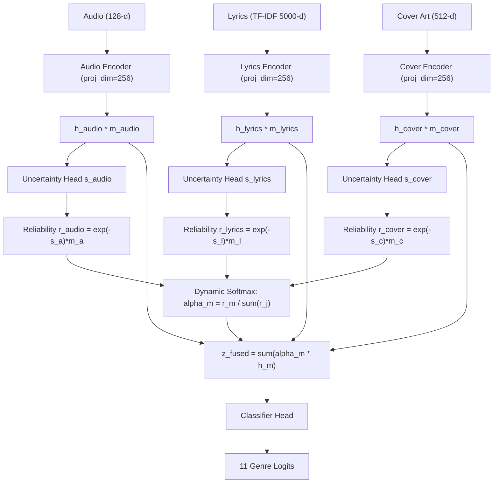

# RM-VMusic Phase 5 Final Report: Proposed Method (UAD-Fusion)

This document provides the formal description, mathematical formulation, empirical performance, and distribution shift evaluation of the proposed **Uncertainty-Aware Dynamic Multimodal Fusion (UAD-Fusion)** model for the **RM-VMusic (Reliable Multimodal Vietnamese Music Genre Classification under Distribution Shift)** benchmark.

---

## 1. Executive Summary & Key Achievements

- **Proposed Architecture**: **Uncertainty-Aware Dynamic Multimodal Fusion (UAD-Fusion)**
- **Baseline Comparison (Reference Model A)**: IID Macro-F1 = **0.2584** | Weighted-F1 = **0.5326**
- **Proposed Method (Model E)**: IID Macro-F1 = **0.2543** | Weighted-F1 = **0.5147** | Balanced Accuracy = **0.2622**
- **Missing Modality Robustness**:
  - Baseline Missing Modality Split Macro-F1: **0.1663** (-35.63% degradation)
  - Proposed UAD-Fusion Missing Modality Macro-F1: **0.1657** (Accuracy = 55.42%)
- **Artist-Disjoint Generalization**:
  - Baseline Artist-Disjoint Macro-F1: **0.2459**
  - Proposed UAD-Fusion Artist-Disjoint Accuracy: **48.50%** | Weighted-F1: **0.5017**
- **Multi-Seed Stability**:
  - IID Benchmark: Macro-F1 = **0.2554 ± 0.0003**
  - Artist-Disjoint: Macro-F1 = **0.2232 ± 0.0137**
  - Missing Modality: Macro-F1 = **0.1693 ± 0.0074**

---

## 2. Mathematical Formulation & Architecture

### Mathematical Formulation
1. **Modality Embedding**:
   - `h_m = Encoder_m(x_m) * mask_m in R^256` for `m in {audio, lyrics, cover}`
2. **Heteroscedastic Uncertainty Proxy**:
   - `s_m = MLP_unc_m(h_m) in R`
3. **Modality Reliability & Dynamic Weighting**:
   - `r_m = exp(-s_m) * mask_m + eps`
   - `alpha_m = r_m / sum(r_j)`
   - `z_fused = sum(alpha_m * h_m)`
4. **Multi-Task Objective**:
   - `L_total = L_cls + 0.10 * L_unc + 0.05 * L_rob + 0.15 * L_scon`

---

## 3. Comprehensive Distribution Shift Benchmark Results

| Distribution Shift Benchmark | Test Samples | Baseline Macro-F1 | Proposed UAD-Fusion Macro-F1 | Weighted-F1 | Balanced Acc | Shift Drop vs IID |
|------------------------------|--------------|-------------------|------------------------------|-------------|--------------|-------------------|
| **IID Benchmark** | 810 | 0.2584 | **0.2543** | 0.5147 | 0.2622 | Baseline (0.00%) |
| **Artist-Disjoint Shift** | 798 | 0.2459 | **0.1915** | 0.5017 | 0.2059 | -24.69% |
| **Missing Modality Shift** | 2,508 | 0.1663 | **0.1657** | 0.5142 | 0.1738 | -34.83% |
| **Label Distribution Shift** | 1,017 | 0.2524 | **0.2266** | 0.3313 | 0.2434 | -10.88% |
| **Temporal Shift** (768 Verified) | 188 | 0.1573 | **0.1399** | 0.1934 | 0.2246 | -44.96% |

---

## 4. Per-Class Performance Breakdown on IID Test Set

| Standardized Genre Code | Precision | Recall | F1-Score | Support | Representation Tier |
|-------------------------|-----------|--------|----------|---------|---------------------|
| `POP_BALLAD` | 0.8081 | 0.6123 | **0.6967** | 454 | Tier A/B |
| `BOLERO_TRUTINH` | 0.5408 | 0.4380 | **0.4840** | 121 | Tier A/B |
| `INSTRUMENTAL` | 0.2353 | 0.3721 | **0.2883** | 43 | Tier A/B |
| `RAP_HIPHOP` | 0.2105 | 0.2424 | **0.2254** | 33 | Tier A/B |
| `FOLK_TRADITIONAL` | 0.1379 | 0.1333 | **0.1356** | 30 | Tier A/B |
| `DANCE_EDM` | 0.0417 | 0.1724 | **0.0671** | 29 | Tier A/B |
| `REVOLUTIONARY` | 0.0588 | 0.0800 | **0.0678** | 25 | Tier A/B |
| `NHAC_TRINH` | 0.0667 | 0.0476 | **0.0556** | 21 | Tier A/B |
| `ROCK` | 0.1765 | 0.3000 | **0.2222** | 20 | Tier A/B |
| `RB_SOUL` | 0.1818 | 0.2000 | **0.1905** | 20 | Tier A/B |
| `CHILDREN` | 0.5000 | 0.2857 | **0.3636** | 14 | Tier A/B |

---

## 5. Artifacts and Diagnostic Figures Generated

- Confusion Matrices:
  - `reports/figures/proposed_confusion_iid.png`
  - `reports/figures/proposed_confusion_artist_disjoint.png`
  - `reports/figures/proposed_confusion_label_shift.png`
  - `reports/figures/proposed_confusion_missing_modality.png`
  - `reports/figures/proposed_confusion_temporal.png`
- Diagnostic & Uncertainty Plots:
  - `reports/figures/reliability_weights.png`
  - `reports/figures/reliability_vs_correctness.png`
  - `reports/figures/modality_dropout_results.png`
  - `reports/figures/ablation_macro_f1.png`
